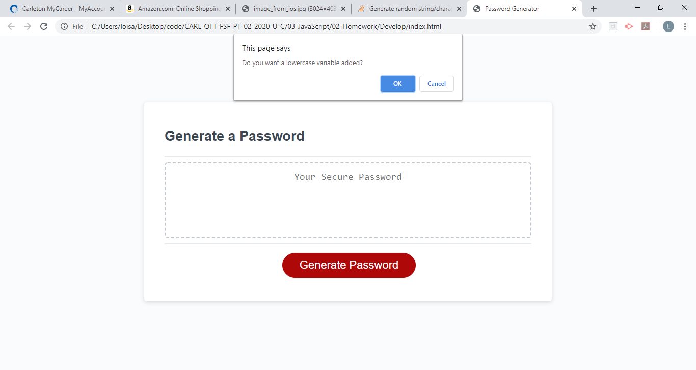

# Password Generator Based on User's Requirement

Create an application that generates a random password based on user-selected criteria. This app will run in the browser and feature dynamically updated HTML and CSS powered by your JavaScript code. It will also feature a clean and polished user interface and be responsive, ensuring that it adapts to multiple screen sizes.

If you are unfamiliar with special characters, take a look at [some examples](https://www.owasp.org/index.php/Password_special_characters).

## Acceptance Criteria

```
1. A series of prompts are shown when button is clicked
2. Randomly generate password based on criteria chosen
3. Prompt should request if user wants lowercase, uppercase, special character and numbers
4. The length of the password should be at least 8 characters and no more than 128 characters

## Methods For The App
---
1. Click the generate button and the first prompt will ask for the size you want 
2. If it is less than 8 characters, greater than 128 or it is not an integer the program will close
3. The next question ask if you want lowercase and only accept lower case alphabets from a-z
4. The next question ask if you want uppercase and only accept upper case alphabets from A-Z
5. The next question ask if you want special character and only accept special characters
6. The next question ask if you want Numbers and only accept numbers from 0-9

Then it generates a random password based on the criteria chosen
```
## Screenshot



## Link To GitHub
Github: https://github.com/loisaleghe/passwordGenerator
GitHub published page: https://loisaleghe.github.io/passwordGenerator/


© 2019 Trilogy Education Services, a 2U, Inc. brand. All Rights Reserved.
